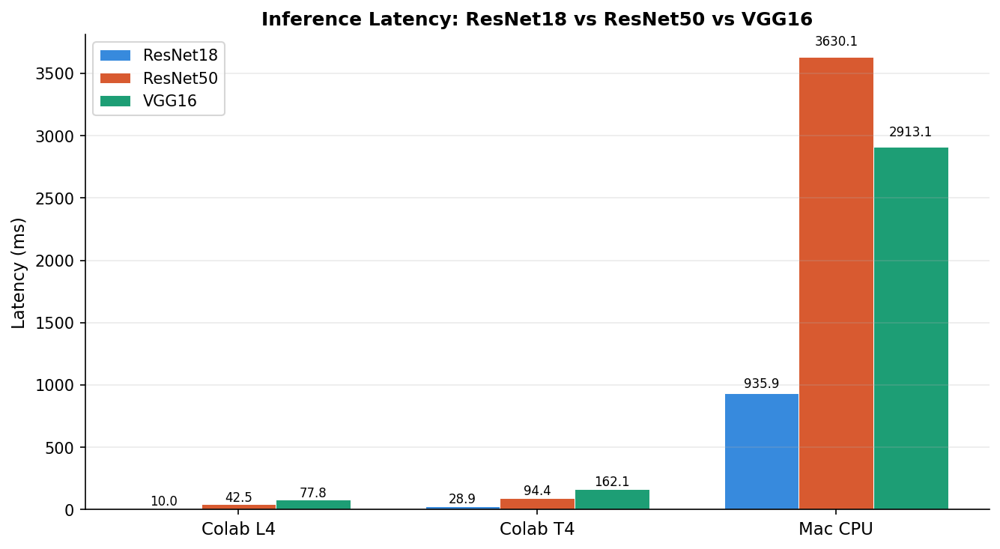
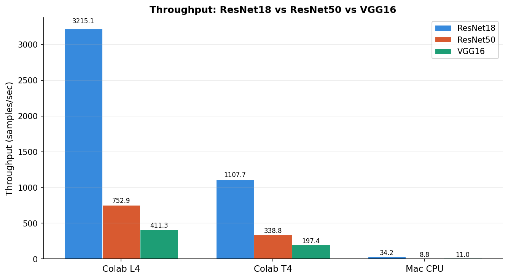
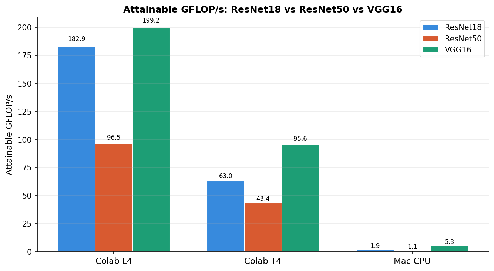
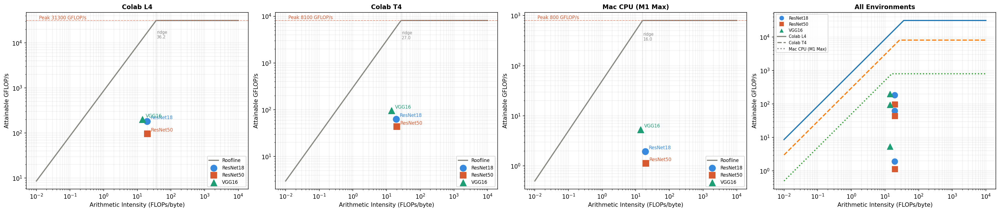

# ⚡ Machine Learning Performance Benchmarking (GPU vs CPU)

A deep dive into how modern neural networks perform across different hardware using **PyTorch, CUDA, and roofline modeling**. This project benchmarks CNN inference across CPUs and GPUs and explains *why* performance differs—not just *how much*.

---

## 🚀 Overview

This project analyzes the performance of three widely used CNN architectures:

* **ResNet18**
* **ResNet50**
* **VGG16**

across three compute environments:

* **Apple M1 Max (CPU)**
* **NVIDIA T4 GPU**
* **NVIDIA L4 GPU**

The goal is to understand:

* How hardware impacts deep learning inference performance
* Whether models are **compute-bound or memory-bound**
* Where real-world performance falls relative to theoretical limits

---

## 🧠 Key Results

* 🚀 Up to **94× speedup** using GPU (L4) over CPU
* ⚡ L4 provides **2–3× higher throughput** than T4
* 📉 All models are **memory-bandwidth bound** on GPUs
* 📊 Models achieve **<5% of theoretical peak performance**

---

## 📊 Benchmark Results

### Throughput Comparison (samples/sec)

| Model    | CPU (M1 Max) | T4 GPU | L4 GPU |
| -------- | ------------ | ------ | ------ |
| ResNet18 | 34.2         | 1107.7 | 3215.1 |
| ResNet50 | 8.8          | 338.8  | 752.9  |
| VGG16    | 11.0         | 197.4  | 411.3  |

---

## 📈 Visualizations

### 🔹 Latency Comparison



### 🔹 Throughput Comparison



### 🔹 GFLOP/s Achieved



### 🔹 Roofline Model Analysis



---

## 🧪 Methodology

### 🔹 Benchmarking Approach

* Implemented in **PyTorch**
* Used **CUDA-synchronized timing** (`torch.cuda.synchronize()`)
* Measured:

  * Latency
  * Throughput
  * GFLOP/s
* Batch size fixed at **32**
* Averaged over multiple runs for stability

### 🔹 Hardware Setup

| Environment | Hardware  | Peak GFLOP/s | Bandwidth |
| ----------- | --------- | ------------ | --------- |
| CPU         | M1 Max    | ~800         | 50 GB/s   |
| GPU         | NVIDIA T4 | 8,100        | 300 GB/s  |
| GPU         | NVIDIA L4 | 31,300       | 864 GB/s  |

---

## 📐 Roofline Modeling

We used the **roofline model** to analyze performance limits:

* Arithmetic Intensity (AI):

  * ResNet18: ~19 FLOPs/byte
  * ResNet50: ~20 FLOPs/byte
  * VGG16: ~14 FLOPs/byte

* Ridge Points:

  * CPU: ~16 FLOPs/byte
  * T4: ~27 FLOPs/byte
  * L4: ~36 FLOPs/byte

👉 Since all models fall **below the ridge point**, they are **memory-bound**, meaning performance is limited by data movement, not computation.

---

## 🔍 Key Insights

* **Memory bandwidth is the bottleneck**, not compute power
* GPUs outperform CPUs due to:

  * Massive parallelism (thousands of CUDA cores)
  * Higher memory bandwidth
* **ResNet18 outperforms ResNet50 in throughput**

  * Better GPU utilization
  * Fewer kernel launches
* **VGG16 achieves highest GFLOP/s**

  * Due to large FLOP count despite low efficiency

---

## ⚠️ Limitations

* Used synthetic input data instead of real datasets
* Only inference (no training benchmarks)
* Small batch size underutilizes GPU
* Did not measure full memory traffic (underestimates AI)

---

## 🔮 Future Work

* Use **FP16 mixed precision** to improve efficiency
* Increase batch size to improve GPU utilization
* Use profiling tools like **NVIDIA Nsight Compute**
* Benchmark training performance

---

## 🧰 Tech Stack

* Python
* PyTorch
* CUDA
* NumPy / Matplotlib
* Google Colab (T4, L4 GPUs)

---

## 📂 Project Structure

```
.
├── src/                # Benchmarking + plotting scripts
├── results/            # JSON outputs from experiments
├── figures/            # Charts and visualizations
├── notebooks/          # Analysis notebook
├── report.pdf          # Full detailed report
└── README.md
```

---

## 👨‍💻 Author

**Madhav Rajkondawar**
M.S. Machine Learning @ Columbia University

---

## ⭐ If you found this interesting, feel free to star the repo!
